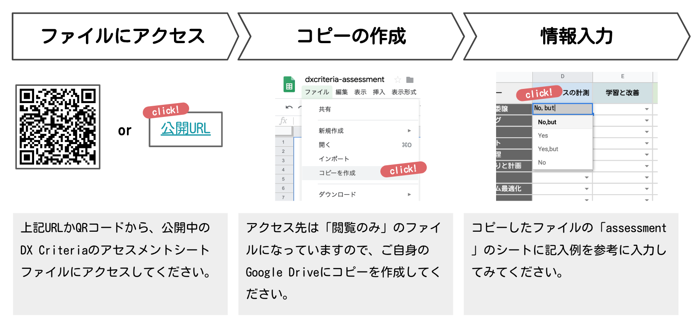
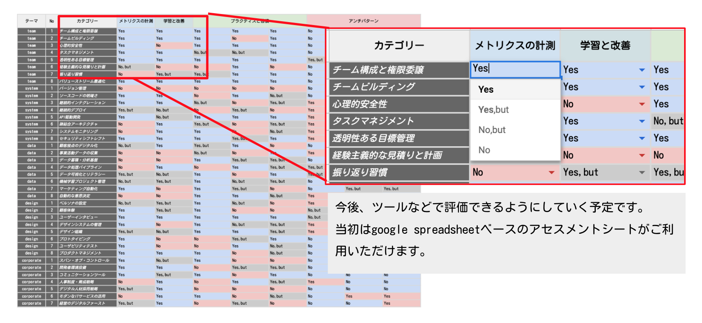
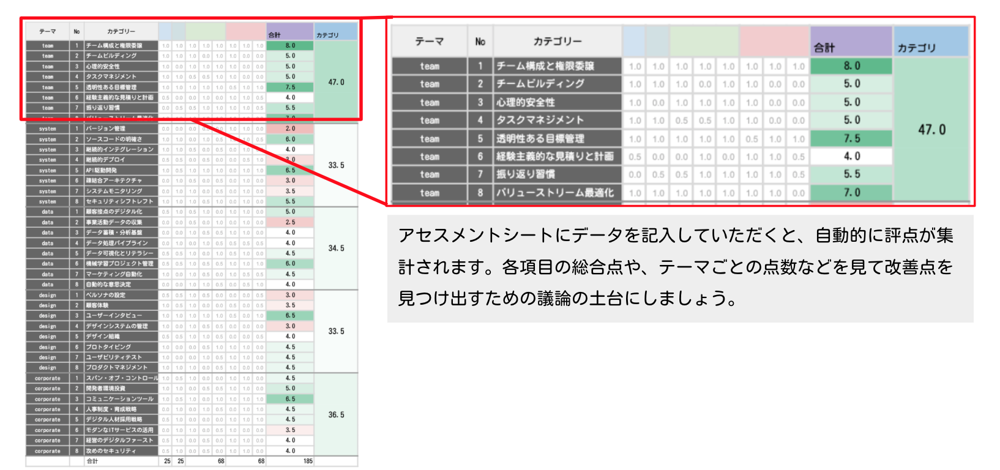
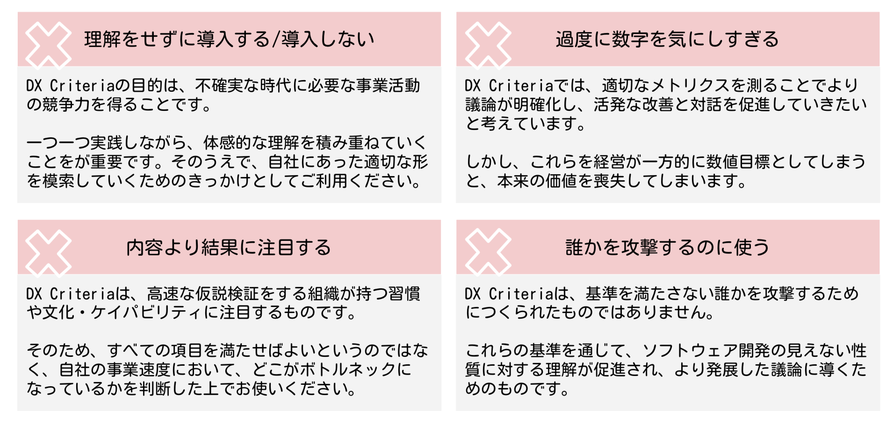

# DX Criteriaの使い方

## ３つの主な使い方
DX Criteriaのご利用に関して、主な使い方は次の３つです。

+ 自社のDX進捗度の簡易的なアセスメント
+ 担当マネージャによるチームとシステムごとの詳細なアセスメント
+ 外部パートナーとのコミュニケーション

たとえば、半期に一度自社によるアセスメントをおこない、自社の強み弱みを把握し、次の一手を話し合ったりすることにご活用ください。
必要に応じて、外部パートナー企業との間で、「どのようにしたら高速な開発ができるのか」を軸に話し合いを進めたり、
自社では足りない部分を補ってもらったり、サービス導入をするなどの議論をすすめる上でも有効です。

また、必要に応じて、チームごと・システムごとのようにテーマごとに分割して、複数の部門に記入していただくなどすることで
部門間の違いや共通の強み・弱みを知ることができます。

## アセスメントシートの使い方

[簡易アセスメントシート dxcriteria-assessment ](https://docs.google.com/spreadsheets/d/1Wnyz6vZVrVnkbteQsrJ7IROFaiFb6ocDLocG2KzzWJs/edit?usp=sharing)にアクセスし、シートをご自身・自社のGoogle Driveにコピーしてご利用ください。

## アセスメントシートの記入方法

### 各項目に対して回答は４種類

戦略上あえて取り入れていない場合や実施しようとしたけれども不完全といったように、YESともNOとも言い切れない項目も
あるかと思います。このような場合価値中立的に0.5点換算します。あまりにこのような項目が多い場合には、ベストプラクティスから離れてしまっていたり、習慣が定着しないなどの組織的問題がはらんでいる可能性があるため注意は必要です。

### シートへの記入

回答用シートに１つ１つ項目を確認しながら記入を行ってください。

### 評価結果の確認

### ご利用上の注意
活用に関して、以下の点にご注意ください。
